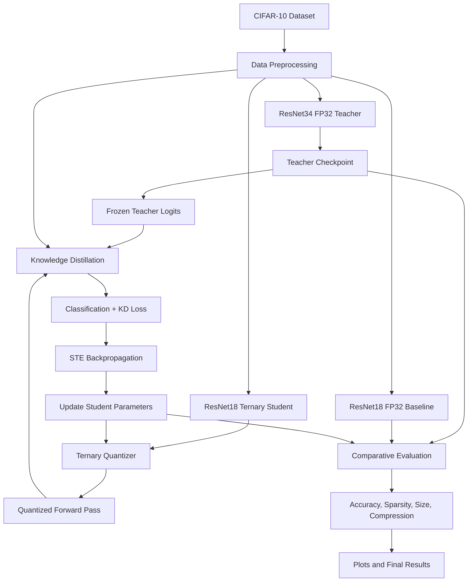

# ATDL: Knowledge Distillation & Ternary Quantization-Aware Training

**Advanced Topics in Deep Learning (ATDL) — Assignment I**

ResNet34 FP32 Teacher → ResNet18 Ternary Student on CIFAR-10

[](https://www.python.org/)
[](https://pytorch.org/)
[](https://www.cs.toronto.edu/~kriz/cifar.html)
[](#license)

## Overview

This repository contains the implementation, training notebooks, evaluation scripts, visualization plots, and trained checkpoints for an Advanced Topics in Deep Learning assignment on **Knowledge Distillation (KD) combined with Ternary Quantization-Aware Training (QAT)**.

The project investigates whether a full-precision ResNet34 teacher can transfer its learned knowledge to a ResNet18 student whose convolutional and fully connected weights are constrained to the ternary set:

$$
W_q \in \{-\alpha, 0, +\alpha\}
$$

Here, \(\alpha\) is a layer-wise or tensor-wise scaling factor. The student is trained using knowledge distillation and quantization-aware training so that ternary weights are used during the forward pass, rather than applying quantization only after training.

The experiments use the CIFAR-10 image classification dataset containing 60,000 RGB images across 10 classes.

### Main objective

Build a compressed ResNet18 student that retains strong classification accuracy while substantially reducing the storage required for model weights.

The project compares three models:

1. Full-precision ResNet34 teacher trained from scratch.
2. Full-precision ResNet18 baseline trained without knowledge distillation.
3. Ternary-weight ResNet18 student trained with KD + QAT.

## Summary of Results

The following results are from the current experimental evaluation included in this repository.

| Model                                | Parameters (M) | Size (MB) | Test Accuracy | Sparsity | Compression vs Teacher |
| ------------------------------------ | -------------: | --------: | ------------: | -------: | ---------------------: |
| ResNet34 Teacher (FP32)              |          21.28 |     81.18 |        96.03% |    Dense |                  1.00× |
| ResNet18 Baseline (FP32)             |          11.17 |     42.63 |        95.55% |    Dense |                  1.90× |
| ResNet18 Student (Ternary, KD + QAT) |          11.17 |      2.74 |        95.15% |    47.2% |                 29.62× |

### Key findings

* The ternary student achieves 95.15% test accuracy on CIFAR-10.
* The student is within 0.88 percentage points of the teacher's test accuracy.
* The reported compressed student checkpoint is 2.74 MB, compared with 81.18 MB for the full-precision teacher.
* The ternary student has 47.2% zero-valued weights, according to the current evaluation.
* The reported compression ratio is 29.62× relative to the teacher and 15.56× relative to the FP32 ResNet18 baseline.

> **Important:** The reported model sizes are checkpoint/storage measurements. The actual inference memory footprint and runtime speedup depend on the deployment implementation. Ternary weights alone do not guarantee a proportional speedup on a standard GPU.

## Table of Contents

* [Overview](#overview)
* [Summary of Results](#summary-of-results)
* [Problem Statement](#problem-statement)
* [Background](#background)
* [Project Architecture](#project-architecture)
* [Repository Structure](#repository-structure)
* [Dataset](#dataset)
* [Model Architectures](#model-architectures)
* [Ternary Quantization](#ternary-quantization)
* [Knowledge Distillation](#knowledge-distillation)
* [Quantization-Aware Training](#quantization-aware-training)
* [Training Pipeline](#training-pipeline)
* [Experimental Configuration](#experimental-configuration)
* [Installation](#installation)
* [Usage](#usage)
* [Evaluation](#evaluation)
* [Compression and Storage](#compression-and-storage)
* [Visualizations](#visualizations)
* [Reproducibility](#reproducibility)
* [Ablation Study](#ablation-study)
* [Limitations](#limitations)
* [Assignment Deliverables](#assignment-deliverables)
* [References](#references)
* [License](#license)

---

## Problem Statement

The assignment requires training a full-precision ResNet34 teacher and transferring its knowledge to a ResNet18 student with ternary-weight quantization-aware training on CIFAR-10.

The implementation addresses the following four tasks.

### Task 1 — ResNet34 teacher

Train a ResNet34 model from scratch on CIFAR-10. The teacher should generalize well and achieve a strong test accuracy with a small train/test performance gap.

### Task 2 — Ternary ResNet18 student

Design a ResNet18 student whose convolutional and fully connected weights are constrained to:

$$
\{-\alpha,0,+\alpha\}
$$

The scaling factor may be derived or learnable, depending on the quantizer implementation.

### Task 3 — Knowledge Distillation + QAT

Train the ternary student using a frozen teacher. The training objective combines the standard classification loss with a temperature-scaled distillation loss.

Quantization-aware training ensures that the ternary representation is used during the forward pass throughout training.

### Task 4 — Comparative evaluation

Compare the teacher, the FP32 ResNet18 baseline, and the ternary student using:

* Test accuracy.
* Model parameter count.
* Storage size.
* Weight sparsity.
* Compression ratio.
* Confusion matrices and training curves.
* Ablation of at least one KD hyperparameter.

---

## Background

### Residual Networks

ResNet introduces residual learning through skip connections, allowing deeper neural networks to be trained effectively.

The CIFAR-10 implementation uses ResNet34 as the teacher and ResNet18 as the student. Both models are adapted for 32×32 RGB images and 10 output classes.

### Knowledge Distillation

Knowledge distillation transfers information from a large teacher network to a smaller student network. Instead of learning only from hard labels, the student also learns from the teacher's soft class probabilities.

The distillation loss uses a temperature \(T\):

$$
p_t = \operatorname{softmax}(z_t/T)
$$

$$
p_s = \operatorname{softmax}(z_s/T)
$$

The combined objective is:

$$
\mathcal{L}_{KD}
=
(1-\lambda)\mathcal{L}_{CE}
+
\lambda T^2\mathcal{L}_{KL}
$$

where:

* \(\mathcal{L}_{CE}\) is the cross-entropy loss against the ground-truth labels.
* \(\mathcal{L}_{KL}\) is the KL-divergence loss between teacher and student soft predictions.
* \(T\) is the distillation temperature.
* \(\lambda\) controls the contribution of distillation.

### Ternary Quantization

Ternary quantization represents each weight using three possible values:

$$
-\alpha,\quad 0,\quad +\alpha
$$

This reduces the number of distinct weight values and enables compact storage.

### Straight-Through Estimator

The ternary quantizer is non-differentiable. A Straight-Through Estimator (STE) is used to approximate gradients during backpropagation, allowing the underlying full-precision parameters to be updated while the forward pass uses quantized weights.

---

## Project Architecture

The project consists of a full-precision teacher, a ternary student, and a common CIFAR-10 evaluation pipeline.



### Training workflow

1. Train the ResNet34 teacher from scratch.
2. Save the best teacher checkpoint.
3. Train a full-precision ResNet18 baseline without KD.
4. Implement and test the ternary quantizer.
5. Load the frozen teacher.
6. Train the ternary ResNet18 student with KD + QAT.
7. Save the best student checkpoint.
8. Evaluate all three models using the same test set.
9. Generate visualizations and compression statistics.
10. Verify the ternary constraint on the saved student weights.

---

## Repository Structure

```text
ATDL/
│
├── codes/
│   ├── task1_resnet34_teacher_.ipynb
│   │   └── Train the ResNet34 FP32 teacher
│   │
│   ├── task2_ternary_quantizer_.ipynb
│   │   └── Implement and test ternary quantization
│   │
│   ├── task3_kd_qat_training_.ipynb
│   │   └── Train the ternary ResNet18 student
│   │
│   ├── task4_resnet18_fp32_baseline_.ipynb
│   │   └── Train the FP32 ResNet18 baseline
│   │
│   ├── task4_final_evaluation_.ipynb
│   │   └── Comparative evaluation and metrics
│   │
│   ├── save_compressed_checkpoint.ipynb
│   │   └── Checkpoint compression and bit-packing
│   │
│   ├── general_visualizations.ipynb
│   │   └── Plots, tables, and analytical visualizations
│   │
│   └── test_custom_images_.ipynb
│       └── Inference on custom images
│
├── visualization/
│   ├── ablation_plot.png
│   ├── accuracy_vs_compression.png
│   ├── confusion_matrices.png
│   ├── final_comparison_table.csv
│   └── ...
│
├── Outputs/
│   └── Trained model weights and checkpoints (.pth)
│
├── requirements.txt
├── README.md
└── LICENSE
```

The notebooks are organized according to the four assignment tasks. The `Outputs` directory contains trained checkpoints, while `visualization` contains the generated plots and evaluation artifacts.

---

## Dataset

### CIFAR-10

The project uses the https://www.cs.toronto.edu/~kriz/cifar.html dataset.

| Property          | Value                |
| ----------------- | -------------------- |
| Total images      | 60,000               |
| Training images   | 50,000               |
| Test images       | 10,000               |
| Image resolution  | 32 × 32              |
| Channels          | 3 (RGB)              |
| Number of classes | 10                   |
| Task              | Image classification |

The ten classes are:

```text
airplane
automobile
bird
cat
deer
dog
frog
horse
ship
truck
```

### Preprocessing

The data pipeline should include the same preprocessing and normalization for all three models. Training augmentation may be applied to the training split, while the test split should use deterministic preprocessing.

The training and evaluation notebooks contain the dataset loading and preprocessing implementation.

---

## Model Architectures

### Teacher — ResNet34 FP32

The teacher is a full-precision ResNet34 trained from scratch on CIFAR-10.

```text
Input: 32 × 32 × 3
        │
    ResNet34
        │
  Global Average Pooling
        │
    Fully Connected
        │
   10-Class Output
```

The teacher provides soft logits for knowledge distillation and acts as the reference model for the compression comparison.

### Baseline — ResNet18 FP32

The baseline is a full-precision ResNet18 trained without knowledge distillation. It establishes the performance and storage requirements of the smaller architecture before ternary quantization.

### Student — ResNet18 Ternary

The student uses the ResNet18 architecture with ternary quantization applied to convolutional and fully connected weights.

```text
Input: 32 × 32 × 3
        │
    ResNet18
        │
 Ternary Quantization
        │
  Global Average Pooling
        │
    Fully Connected
        │
   10-Class Output
```

The student learns from both the CIFAR-10 ground-truth labels and the teacher's soft predictions.

---

## Ternary Quantization

### Quantizer definition

The ternary quantizer maps a full-precision weight tensor to three values:

$$
Q(W)=
\begin{cases}
+\alpha & W>\Delta \\
0 & |W|\leq\Delta \\
-\alpha & W<-\Delta
\end{cases}
$$

Here:

* \(W\) is the underlying full-precision parameter tensor.
* \(\Delta\) is the quantization threshold.
* \(\alpha\) is the scaling factor.
* \(Q(W)\) is the ternary weight tensor used in the forward pass.

The exact threshold and scaling-factor calculation are defined in the quantizer notebook.

### Forward and backward pass

```text
Full-Precision Weights
          │
          ▼
    Ternary Quantizer
          │
          ▼
   {-α, 0, +α} Weights
          │
          ▼
    Forward Pass
          │
          ▼
     Loss Function
          │
          ▼
 Straight-Through Estimator
          │
          ▼
 Update Full-Precision
    Underlying Weights
```

The quantizer notebook contains unit tests and demonstrations of the ternary representation.

### Ternary constraint verification

After training, the saved student checkpoint is checked to ensure that the quantized weights contain only the allowed ternary values.

For each quantized tensor, the verification should confirm:

$$
w_i\in\{-\alpha,0,+\alpha\}
$$

The verification script is included in the checkpoint compression and evaluation workflow.

---

## Knowledge Distillation

The student is trained using a frozen ResNet34 teacher.

The teacher is evaluated in inference mode during student training, and its parameters are not updated by the student loss.

### Distillation objective

The student loss combines hard-label classification with teacher-guided learning:

$$
\mathcal{L}
=
(1-\lambda)\mathcal{L}_{CE}
+
\lambda T^2\mathcal{L}_{KD}
$$

The classification term encourages correct CIFAR-10 predictions. The distillation term encourages the student to match the teacher's class distribution.

### Training procedure

```python
teacher.eval()

for images, labels in train_loader:
    optimizer.zero_grad()

    with torch.no_grad():
        teacher_logits = teacher(images)

    student_logits = student(images)

    loss = kd_loss(
        student_logits,
        teacher_logits,
        labels,
        temperature=T,
        alpha=lambda_kd
    )

    loss.backward()
    optimizer.step()
```

The code above illustrates the training logic. The actual implementation is available in `task3_kd_qat_training_.ipynb`.

---

## Quantization-Aware Training

Quantization-aware training integrates the ternary quantizer into the student model during training.

Unlike post-training quantization, the student is exposed to quantized weights during its forward pass while the underlying trainable parameters remain full precision.

### QAT workflow

```text
Full-Precision Parameter
          │
          ▼
   Ternary Quantization
          │
          ▼
   Quantized Convolution
          │
          ▼
    Model Prediction
          │
          ▼
      KD + CE Loss
          │
          ▼
    STE Gradients
          │
          ▼
 Parameter Update
```

The QAT student training pipeline is implemented in `task3_kd_qat_training_.ipynb`.

---

## Training Pipeline

### Phase 1 — Train the teacher

Train ResNet34 from scratch using CIFAR-10.

Output:

```text
Outputs/
└── best_teacher.pth
```

The checkpoint filename above is illustrative; use the actual saved filename in the repository.

### Phase 2 — Train the FP32 baseline

Train ResNet18 without knowledge distillation or ternary quantization.

Output:

```text
Outputs/
└── best_resnet18_fp32.pth
```

### Phase 3 — Test the ternary quantizer

Run the quantizer notebook to verify the quantization rule, scaling-factor behavior, and gradient flow.

### Phase 4 — Train the ternary student

Load the frozen teacher checkpoint and train the ternary ResNet18 student with KD + QAT.

Output:

```text
Outputs/
└── best_ternary_student.pth
```

### Phase 5 — Compress the checkpoint

Use `save_compressed_checkpoint.ipynb` to pack ternary weight values into a compact representation and calculate storage requirements.

### Phase 6 — Evaluate

Run the final evaluation notebook to compare all models and generate the final metrics table.

---

## Experimental Configuration

The project uses the following high-level configuration.

| Configuration     | Value                        |
| ----------------- | ---------------------------- |
| Dataset           | CIFAR-10                     |
| Teacher           | ResNet34                     |
| Student           | ResNet18                     |
| Teacher precision | FP32                         |
| Student precision | Ternary weights              |
| Training method   | KD + QAT                     |
| Optimizer         | Defined in training notebook |
| Learning rate     | Defined in training notebook |
| Batch size        | Defined in training notebook |
| Number of epochs  | Defined in training notebook |
| KD temperature    | Defined in training notebook |
| KD loss weight    | Defined in training notebook |
| Random seed       | Defined in training notebook |
| Device            | CUDA-enabled GPU recommended |

The exact hyperparameter values used for the final reported results should be recorded in the report and kept consistent with the training notebooks.

---

## Installation

### Requirements

* Python 3.x.
* PyTorch and torchvision.
* NumPy.
* Matplotlib.
* Pandas.
* Jupyter Notebook or JupyterLab.
* CUDA-enabled GPU recommended for training.

### Clone the repository

```bash
git clone https://github.com/prxshu05/ATDL.git
cd ATDL
```

Replace the repository URL with the actual GitHub repository URL if the project is stored under a different name.

### Install dependencies

```bash
pip install -r requirements.txt
```

For GPU training, ensure that the installed PyTorch version is compatible with your NVIDIA driver and CUDA environment.

### Launch Jupyter Notebook

```bash
jupyter notebook
```

Open the notebooks in the `codes/` directory and run them according to the task order.

---

## Usage

### 1. Train the teacher

Open:

```text
codes/task1_resnet34_teacher_.ipynb
```

Train the ResNet34 model and save the best checkpoint.

### 2. Test the ternary quantizer

Open:

```text
codes/task2_ternary_quantizer_.ipynb
```

Run the quantizer implementation and its tests.

### 3. Train the KD + QAT student

Open:

```text
codes/task3_kd_qat_training_.ipynb
```

Load the teacher checkpoint, configure the training parameters, and train the ternary ResNet18 student.

### 4. Train the FP32 baseline

Open:

```text
codes/task4_resnet18_fp32_baseline_.ipynb
```

Train the full-precision ResNet18 baseline without KD.

### 5. Run comparative evaluation

Open:

```text
codes/task4_final_evaluation_.ipynb
```

Evaluate the three models using the CIFAR-10 test set.

### 6. Compress the student checkpoint

Open:

```text
codes/save_compressed_checkpoint.ipynb
```

Generate the compressed ternary representation and verify the storage measurements.

### 7. Generate visualizations

Open:

```text
codes/general_visualizations.ipynb
```

Generate training curves, comparison plots, confusion matrices, and other analytical visualizations.

### 8. Test custom images

Open:

```text
codes/test_custom_images_.ipynb
```

Load the trained model and run inference on custom CIFAR-10-like images.

---

## Evaluation

The evaluation compares the teacher, FP32 baseline, and ternary student on the same CIFAR-10 test split.

### Metrics

#### Test accuracy

Percentage of test images classified correctly.

$$
\text{Accuracy}
=
\frac{\text{Correct Predictions}}{\text{Total Test Images}}
\times 100
$$

#### Parameter count

Number of trainable model parameters.

#### Model storage size

The size of the saved model representation in megabytes.

#### Weight sparsity

The percentage of quantized weights equal to zero.

$$
\text{Sparsity}
=
\frac{\#\{w_i=0\}}{\#\{w_i\}}
\times 100
$$

#### Compression ratio

The ratio of the reference model storage size to the compressed model storage size.

$$
\text{Compression Ratio}
=
\frac{\text{Reference Size}}{\text{Compressed Size}}
$$

### Comparative results

The final evaluation produces a comparison table containing model parameters, accuracy, storage size, sparsity, and compression ratio.

The current reported results are summarized below.

| Metric                 |  Teacher | FP32 Baseline | Ternary Student |
| ---------------------- | -------: | ------------: | --------------: |
| Architecture           | ResNet34 |      ResNet18 |        ResNet18 |
| Precision              |     FP32 |          FP32 |         Ternary |
| Test accuracy          |   96.03% |        95.55% |          95.15% |
| Parameters             |   21.28M |        11.17M |          11.17M |
| Model size             | 81.18 MB |      42.63 MB |         2.74 MB |
| Sparsity               |    Dense |         Dense |           47.2% |
| Compression vs teacher |    1.00× |         1.90× |          29.62× |

---

## Compression and Storage

Ternary quantization reduces the number of distinct values used to represent the model weights.

A ternary weight can be represented using two bits:

| Ternary code | Weight |
| ------------ | ------ |
| `00`         | 0      |
| `01`         | +α     |
| `10`         | −α     |

The scaling factor \(\alpha\) must also be stored, along with any additional model information needed for inference.

### Bit-packing

The checkpoint compression notebook packs ternary values into a compact representation. The resulting file size is then compared against the original FP32 checkpoints.

The current reported compressed student size is 2.74 MB.

### Storage comparison

```text
ResNet34 FP32 Teacher       81.18 MB
ResNet18 FP32 Baseline     42.63 MB
ResNet18 Ternary Student    2.74 MB
```

The compressed student requires approximately 3.38% of the teacher's reported storage size.

---

## Visualizations

The `visualization/` directory contains the plots and tables generated during the experiments.

### Ablation plot

`ablation_plot.png`

Shows the effect of a selected knowledge distillation hyperparameter on student performance.

### Accuracy versus compression

`accuracy_vs_compression.png`

Compares model accuracy against storage compression for the teacher, FP32 baseline, and ternary student.

### Confusion matrices

`confusion_matrices.png`

Visualizes class-wise prediction behavior on the CIFAR-10 test set.

### Final comparison table

`final_comparison_table.csv`

Contains the comparative model metrics generated by the evaluation notebook.

### Training curves

Training and validation loss/accuracy curves are generated by the visualization notebook and should be included in the final report.

---

## Reproducibility

To reproduce the experiments:

1. Install the dependencies listed in `requirements.txt`.
2. Use the same CIFAR-10 dataset and preprocessing pipeline.
3. Set the random seed before model initialization and training.
4. Use the same model architectures and hyperparameters recorded in the notebooks.
5. Train the teacher before the student.
6. Use the saved teacher checkpoint for KD + QAT training.
7. Evaluate all models on the same test split.
8. Verify the ternary constraint on the saved student checkpoint.
9. Record the software, hardware, and training configuration in the final report.

### Reproducibility checklist

* [ ] Fixed random seed(s).
* [ ] Dataset preprocessing documented.
* [ ] Teacher checkpoint saved.
* [ ] FP32 baseline checkpoint saved.
* [ ] Ternary student checkpoint saved.
* [ ] Exact training hyperparameters recorded.
* [ ] Requirements file included.
* [ ] Ternary verification script included.
* [ ] Evaluation results reproducible.
* [ ] Training curves generated.
* [ ] KD hyperparameter ablation completed.

---


## Limitations

1. **Model compression versus inference acceleration:** Ternary weights reduce storage, but actual inference speedup requires hardware or kernels that support efficient ternary operations.

2. **Scaling-factor overhead:** The scaling factors and any additional checkpoint metadata contribute to the final storage size.

3. **Quantization granularity:** Layer-wise or tensor-wise scaling factors may not represent every layer equally well.

4. **Dataset scope:** The experiments are conducted on CIFAR-10, so the results do not directly establish performance on larger or more complex datasets.

5. **Training stability:** The combination of KD and QAT can be sensitive to the temperature, distillation weight, learning rate, and quantization threshold.

6. **Checkpoint reproducibility:** The final reported metrics depend on the exact training configuration, random seeds, and saved checkpoints.

7. **Storage accounting:** Compression ratios should be reported using a consistent definition of model size, including any necessary scaling factors and metadata.

---

## Assignment Deliverables

This repository is organized to support the required submission of code, report, and trained checkpoints.

### Code

* CIFAR-10 data pipeline.
* ResNet34 teacher training.
* Ternary quantizer implementation and tests.
* KD + QAT student training.
* FP32 ResNet18 baseline training.
* Comparative evaluation.
* Checkpoint compression and verification.
* Visualization notebooks.

### Report (PDF)

The report should contain:

* Problem statement and motivation.
* Architecture diagrams.
* Model and quantizer implementation.
* Training hyperparameters.
* Training and validation curves.
* Comparative evaluation table.
* KD hyperparameter ablation.
* Compression methodology.
* Discussion and limitations.
* References.

### Checkpoints

The submission should include:

* Best ResNet34 teacher checkpoint.
* Best ternary ResNet18 student checkpoint.
* FP32 ResNet18 baseline checkpoint, if included in the final evaluation.
* Script or notebook to verify the ternary constraint on the saved weights.

### Reproducibility

The repository includes:

* `requirements.txt`.
* Training notebooks.
* Evaluation notebooks.
* Visualization scripts/notebooks.
* Checkpoint compression workflow.

---

## References

1. He, K., Zhang, X., Ren, S., & Sun, J. (2016). Deep Residual Learning for Image Recognition. *Proceedings of the IEEE Conference on Computer Vision and Pattern Recognition (CVPR)*.

2. Hinton, G., Vinyals, O., & Dean, J. (2015). Distilling the Knowledge in a Neural Network. *NeurIPS Deep Learning and Representation Learning Workshop*.

3. Li, F., Zhang, B., & Liu, B. (2016). Ternary Weight Networks. *arXiv preprint arXiv:1605.04711*.

4. Zhu, C., Han, S., Mao, H., & Dally, W. J. (2017). Trained Ternary Quantization. *International Conference on Learning Representations (ICLR)*.

5. Bengio, Y., Léonard, N., & Courville, A. (2013). Estimating or Propagating Gradients Through Stochastic Neurons for Conditional Computation. *arXiv preprint arXiv:1308.3432*.

6. Yin, H., Molchanov, P., Alvarez, J. M., Li, Z., Mallya, A., Hoiem, D., Jha, N., & Kautz, J. (2019). Understanding Straight-Through Estimator in Training Activation Quantized Neural Nets. *International Conference on Learning Representations (ICLR)*.

7. Krizhevsky, A. (2009). Learning Multiple Layers of Features from Tiny Images. University of Toronto. CIFAR-10 dataset.

---

## License

This repository is intended for academic coursework and research experimentation.

The code and results are provided for educational purposes. Please cite the original research papers when using the techniques or implementations described in this project.

## Author

**S. Venkata Prasanna Bhargava**

Bachelor of Technology (Hons) — Computer Science and Engineering (Data Science)

Vidyashilp University

GitHub: https://github.com/prxshu05
